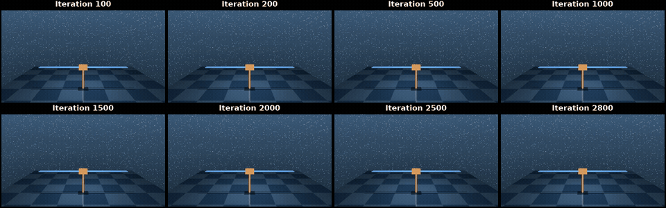

<h1 align="center">Global Optimality for Constrained Exploration via Penalty Regularization</h1>

<p align="center">
  <strong>Florian Wolf &nbsp;·&nbsp; Ilyas Fatkhullin &nbsp;·&nbsp; Niao He</strong><br>
  California Institute of Technology & ETH Zürich<br>
  Neural Information Processing Systems (NeurIPS) 2026
</p>

<p align="center">
  <a href="https://arxiv.org/abs/2604.28144">Paper (arXiv)</a> ·
  <a href="#overview">Overview</a> ·
  <a href="#installation">Installation</a> ·
  <a href="#running-the-experiments">Run experiments</a> ·
  <a href="#citation">Citation</a>
</p>

<p align="center">
  <a href="assets/training-grid.mp4">
    
  </a>
</p>

<p align="center">
  <strong>Constrained exploration throughout training.</strong><br>
  SafeCartpole at eight training checkpoints, from iteration 100 to 2800 (seed 2).<br>
  <a href="assets/training-grid.mp4">Watch the full video</a> ·
  <a href="assets/videos/">Individual rollouts</a>
</p>

## Overview

Policy Gradient Penalty (PGP) uses penalty regularization for maximum-entropy exploration under constraints. This repository contains the implementation and baselines for the experiments in the paper.

| Experiment | Setting | Implementation |
| :--- | :--- | :--- |
| GridWorld | Discrete exploration with safety constraints | [GridWorld code and configurations](code/gridworld/) |
| PointMass | Continuous exploration with a KL-divergence constraint relative to a reference occupancy | [PointMass training](code/continuous/point_mass_main.py) |
| SafeCartpole | Continuous exploration with a cart-position constraint | [SafeCartpole training](code/continuous/main.py) |

See the appendix of the [paper on arXiv](https://arxiv.org/abs/2604.28144) for the experimental setup, hyperparameters, and evaluation details.

## Installation

```bash
git clone https://github.com/Flo-Wo/penalty-based-constrained-exploration.git
cd penalty-based-constrained-exploration
```

The discrete and continuous experiments use separate environments. Run the following commands from the repository root.

### GridWorld

```bash
conda create -n neurips-gridworld python=3.10.19 -y
conda activate neurips-gridworld
python -m pip install -r code/gridworld/requirements.txt
```

### Continuous control

```bash
conda create -n neurips-control python=3.11.14 -y
conda activate neurips-control
python -m pip install -r code/continuous/requirements.txt
```

Rendering the continuous-control videos requires OpenGL and FFmpeg. If FFmpeg is not already installed, install it in the active environment with `conda install -c conda-forge ffmpeg`.

## Running the experiments

Each example below starts from the repository root. Use the settings in the paper appendix for the corresponding paper experiments; the commands below show the entry points.

### GridWorld

```bash
conda activate neurips-gridworld
cd code/gridworld
python Penalty_run.py 2_PenaltyAblation.json --task-id 0
```

`--task-id 0` selects one configuration and seed from the supplied sweep. Omit `--task-id` to run the full sweep locally. Results are written to the `PATH` in the JSON configuration. The [GridWorld README](code/gridworld/README.md) lists the supplied configurations and baseline commands.

### SafeCartpole

```bash
conda activate neurips-control
cd code/continuous
python main.py --seed 0 --beta 10.0 --slider_limit 2.0
```

### PointMass

First train the reference policy and estimate its occupancy, then run constrained exploration:

```bash
conda activate neurips-control
cd code/continuous
python train_ref_policy.py --seed 0
python point_mass_main.py --seed 0 --beta 10.0 --kappa 1.0
```

The first command produces `checkpoints/ref_point_mass/ref_sac.zip` and `checkpoints/ref_point_mass/ref_occ.pt`, which the second command loads by default. The continuous-control scripts accept `--help` to list their options.

## Repository structure

```text
assets/             Training preview, full video, and individual rollouts
code/gridworld/     Discrete experiments, baselines, and JSON configurations
code/continuous/    SafeCartpole, PointMass, and reference-policy training
CITATION.cff        arXiv citation metadata
LICENSE             MIT license
```

## Citation

If you use this code, please cite the [arXiv preprint](https://arxiv.org/abs/2604.28144).

```bibtex
@misc{wolf2026constrainedexploration,
  title         = {Global Optimality for Constrained Exploration via Penalty Regularization},
  author        = {Wolf, Florian and Fatkhullin, Ilyas and He, Niao},
  year          = {2026},
  eprint        = {2604.28144},
  archivePrefix = {arXiv},
  primaryClass  = {cs.LG},
  doi           = {10.48550/arXiv.2604.28144},
  url           = {https://arxiv.org/abs/2604.28144}
}
```

## License

This code is released under the [MIT license](LICENSE).
